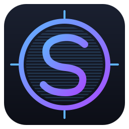

<div align="center">



# ShaderScope

**Apply RetroArch slang shaders as a live overlay on your Linux desktop.**

[](LICENSE)
[](https://en.cppreference.com/w/cpp/20)
[](https://www.vulkan.org/)
[](https://www.libsdl.org/)
[](https://github.com/ocornut/imgui)
[](https://www.kernel.org/)

Capture your screen on X11 (XComposite + XShm) or Wayland (xdg-desktop-portal
+ PipeWire). Pipe it through a RetroArch slang shader — CRT scanlines, NTSC
ringing, bilinear sharpening, color grading, more than a thousand presets in
the wild, single- and multi-pass. Drop a `.slangp` on the window to load it,
tweak per-pass parameters in real time, F11 a frame to PNG, F2 to hide
chrome for overlay-style use.

</div>

---

## Status

| Milestone | Scope | State |
|---|---|---|
| M1 | Vulkan/SDL3 foundation, passthrough render, headless mode | shipped |
| M2 | Wayland capture (xdg-desktop-portal + PipeWire + DMA-BUF) | shipped |
| M3 | X11 capture (XComposite + XShm, CPU upload) | shipped |
| M3.5 | X11 DMA-BUF fast path (EGL + DRI3) | pending |
| M4 | Dear ImGui UI (source picker, preset browser, params, session restore) | shipped |
| M5 UX-polish | Toast UI, first-run UX, region/crop, screenshot capture | shipped |
| M5 feature-complete | Multi-pass shaders, runtime `.slangp` import (DnD + path input), hotkeys (F1-F4/F11/B/[/]) | shipped |
| Future | True click-through X11 overlay, LUT support, per-pass scale factors, M3.5 DMA-BUF fast path | pending |

> ShaderScope started as a Linux port of [mausimus/ShaderGlass](https://github.com/mausimus/ShaderGlass)
> (Windows / DirectX 11). The `master` branch still has the original
> Windows source; `linux/main` is its own thing now — Vulkan, SDL3, ImGui,
> full standalone. The two ports still share the `ShaderGC/` slang→SPIR-V
> compiler from the upstream codebase. GPL v3.

## Install

**AppImage (recommended, no system deps):**

```bash
./packaging/build-appimage.sh        # produces ShaderScope-<commit>-x86_64.AppImage
chmod +x ShaderScope-*.AppImage
./ShaderScope-*.AppImage
```

**From source:**

```bash
cmake -S . -B build -DCMAKE_BUILD_TYPE=Release
cmake --build build -j
sudo cmake --install build           # installs to /usr/local — binary, .desktop, icon, man page
shaderscope                          # appears in launchers as 'ShaderScope'
```

Distro-specific dependency lists in [docs/build-linux.md](docs/build-linux.md).

## Quick start

```bash
shaderscope                                        # GUI: source picker, last session restored
shaderscope --capture x11-screen --source monitor:root
shaderscope --capture wayland-screen               # via xdg-desktop-portal
shaderscope --list-sources                         # scripted use
shaderscope --headless --input in.png --output out.png --preset some.slangp
man shaderscope                                    # full reference
```

## Hotkeys

| Key | Action |
|---|---|
| `F11` | Screenshot |
| `B` | Bypass toggle (active preset ⇄ passthrough) |
| `[` / `]` (or PageUp/PageDown) | Cycle previous/next preset |
| `F1` | Hotkey help toast |
| `F2` | Hide/show ImGui chrome |
| `F3` | Toggle always-on-top |
| `F4` | Toggle borderless |
| `Esc` | Close |

Drag a `.slangp` file onto the window to import it, or use the **Import…**
section in the preset browser to type a path.

## Architecture

| Layer | Files | Notes |
|---|---|---|
| Capture | `src/capture/` | `X11Capture` + `RealX11CaptureSession` (XShm), `WaylandCapture` + `PortalCaptureSession` (PipeWire), `StaticImageCapture` (PNG via stb). Common `CaptureBackend` interface. |
| Render | `src/render/` | `VulkanContext` + `Swapchain` + `RenderEngine`. `ShaderPipeline` runs the passthrough or a slang-compiled fragment shader. `Preset` wraps a `.slangp` preset (single-pass for now). |
| UI | `src/ui/` | `ImGuiLayer` + panels (`SourcePickerPanel`, `PresetBrowserPanel`, `ParamsPanel`, `CropOverlay`, `ToastPanel`). `AppState` carries shared mutable state; `applyPending()` is the sole capture/preset rebuild point. |
| Util | `src/util/` | `ConfigStore` (JSON via nlohmann), `PresetLibrary`, `Logging`, `ToastQueue`, `ScreenshotWriter`, `Time`, `XdgConfig`. |
| Shader compiler | `ShaderGC/` | Shared with the Windows trunk (HLSL/SPIRV files stubbed out on Linux — Vulkan consumes SPIR-V directly). |

Detailed conventions, gotchas, and design specs:
- [CLAUDE.md](CLAUDE.md) — architecture overview, build commands, code gotchas
- [docs/superpowers/specs/](docs/superpowers/specs/) — per-milestone design specs
- [docs/superpowers/plans/](docs/superpowers/plans/) — per-milestone TDD task plans
- [docs/manual-tests-m{1..5}*.md](docs/) — per-milestone manual smoke checklists

## Tests

```bash
ctest --test-dir build --output-on-failure
```

~76 gtest binaries: unit tests for ShaderGC, render pipeline, capture sessions
(real + fake), config persistence, source matching, toast queue, crop overlay,
screenshot path/encode. One test (`DmaBufImport.ImportsGbmAllocatedBuffer`)
skips on systems without a GBM-capable iGPU.

## Migration from the old `shaderglass` Linux binary

If you used the pre-rebrand Linux fork (back when it was still called
`shaderglass`), your config auto-imports on first launch — the shim
copies `~/.config/shaderglass/` into `~/.config/shaderscope/` and stays
out of the way after that. Your last source, last preset, per-source
crops, and ImGui layout all carry over. A one-line stderr notice + toast
confirms the migration.

## Credits

- Upstream Windows project: [mausimus/ShaderGlass](https://github.com/mausimus/ShaderGlass) — GPL v3
- Shaders: [libretro/slang-shaders](https://github.com/libretro/slang-shaders)
- License: [GPL v3](LICENSE)
